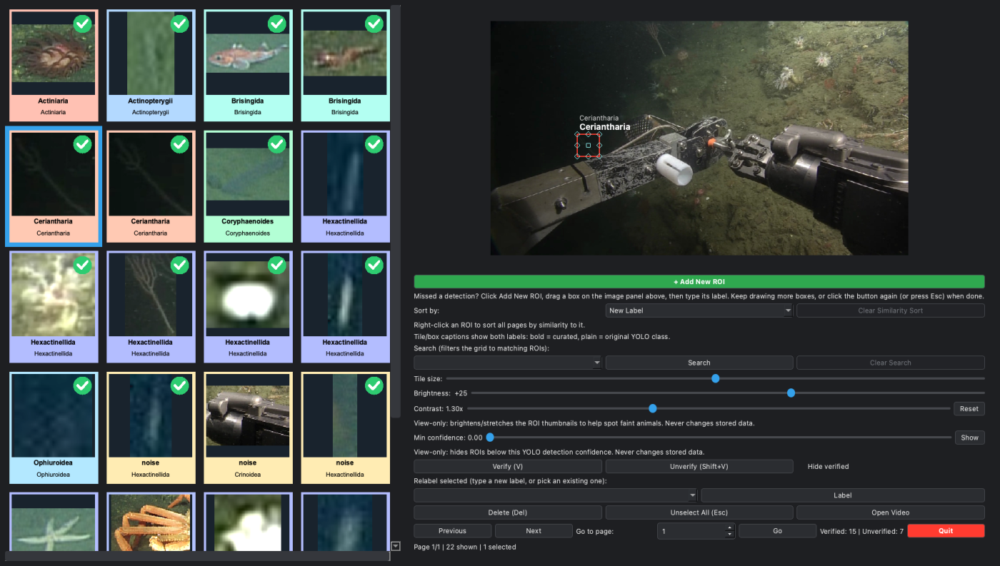

# mbari-ml pipeline

Turn raw survey imagery **or video** into a curated, labeled DuckDB database,
then out again as training data. Four phases:

| Phase | Commands | What it does |
|---|---|---|
| **Ingest** | `infer images`, `infer video` | pixels + detections into a database |
| **Enrich** | `embed`, `cluster`, `refine` | embeddings and grouping |
| **Curate** | `review`, `remap-labels` | human review and relabeling |
| **Emit** | `export {voc,yolo,id,html}`, `stats`, `query` | annotations, galleries, numbers |



*`mbariml review` — the curation GUI. Left: the ROI mosaic, tinted by label
with a green check on verified ROIs, here brightened a little with the
Brightness/Contrast sliders. Right: the full source frame with every
detection overlaid as a draggable box (the selected one in red), over the
controls panel. "Open Video" is live because this ROI came from
`infer video`, so it jumps straight to that moment in the source footage.*

**Also in this repo:** [`cheat_sheet.txt`](cheat_sheet.txt) (one worked
example per command, plus verbatim `--help` for all of them) ·
[`docs/SCHEMA.md`](docs/SCHEMA.md) (what's in the database, column by
column) · [`CHANGELOG.md`](CHANGELOG.md) (what changed, and why).

## Setup

```bash
pip install -e .
```

This installs the `mbariml` command. Because it's an **editable** install,
editing any `.py` file takes effect the next time you run `mbariml` — no
reinstall needed. Re-run `pip install -e .` only when `pyproject.toml`
changes (a new dependency, mainly). (`requirements.txt` is also kept, fixed,
for anyone who just wants `pip install -r requirements.txt` — see "What
changed" below for why it needed fixing.)

## Start anywhere

Every command reads/writes the **same database schema** and just operates on
whatever database you point it at — there's no hidden state, and no command
needs any specific earlier one to have run, only a database that already has
what it needs (`embed` needs ROI blobs, `cluster` needs embeddings). So both
ingest commands are standalone entry points:

```bash
mbariml infer images runs/train/best.pt /data/new_survey/  /data/results/
mbariml infer video  runs/train/best.pt /data/dive_video/  /data/results/
```

...and because they write the same schema as everything else, you can
continue straight into anything downstream:

```bash
mbariml review      /data/results/yolo_predictions.duckdb
mbariml embed       /data/results/yolo_predictions.duckdb
mbariml export html /data/results/yolo_predictions.duckdb /data/results/html
```

All commands:

| Command | Phase | What it does |
|---|---|---|
| `mbariml infer images` | Ingest | Detect on a directory of images; crop ROIs into a database (see below) |
| `mbariml infer video`  | Ingest | Detect on video, by tracking or frame striding (see below) |
| `mbariml embed`        | Enrich | Compute a DINOv3 embedding for every ROI |
| `mbariml cluster`      | Enrich | Cluster embeddings with EVoC, name clusters, export review grids (see below) |
| `mbariml refine`       | Enrich | Re-cluster one label's ROIs into finer sub-clusters |
| `mbariml review`       | Curate | Interactive GUI for labeling/deleting/adding ROIs |
| `mbariml remap-labels` | Curate | Bulk-rename `new_label` values from a CSV |
| `mbariml export voc`   | Emit | Pascal VOC XML |
| `mbariml export yolo`  | Emit | YOLO label files + names.txt (see below) |
| `mbariml export id`    | Emit | `*.id` sidecar next to each source image (see below) |
| `mbariml export html`  | Emit | Paginated HTML gallery of images + crops |
| `mbariml stats`        | Emit | Label counts, boxes-per-image stats, image × label matrix (see below) |
| `mbariml query`        | Emit | Ad hoc SQL against a database |
| `mbariml run`          | — | Chain ingest → embed → cluster → export |

Run `mbariml <command> --help` for the full option list (`mbariml infer
--help` / `mbariml export --help` for the groups).

### Ingest: images

`infer images` is the merge of what used to be two nearly-identical commands,
`detect` and `infer-images` (v0.11.0). They wrote the same schema and cropped
ROIs the same way; the entire real difference was batching, annotated-image
saving, and a 16× gap in default confidence — flags and defaults, not
architecture. Keeping two copies meant every fix had to be made twice. The
intent distinction survives as `--preset`:

- **`--preset curate`** (default) — conf 0.005, imgsz 1952, no annotated
  images. Mine everything, then cluster/review and discard the noise. Default
  deliberately: an over-permissive threshold is recoverable (filter later —
  the review GUI even has a min-confidence slider), while a too-strict one
  silently drops detections you can't get back without a full re-run.
- **`--preset predict`** — conf 0.08, imgsz 992, saves annotated images.
  Believable predictions over new imagery.

Any individual option overrides its preset.

### Ingest: video

```bash
mbariml infer video models/best.pt /data/dive_video/ /data/results/
```

**`--mode track` (default) keeps ONE ROI per tracked object.** This is what
you want for building curation/training data from video: a sponge in view for
300 frames is one animal, not 300 training examples — 300 near-identical
crops would swamp clustering and be tedious to review. Measured on a real
8-second benthic clip: **633 observations collapsed to 4 tracks → 4 ROIs.**

Tracking is necessarily **two passes**, because a track's representative
frame can't be chosen until the track has ended:

1. Track the whole video, recording per-track *metadata* only (frame, box,
   confidence, class). No pixels retained, so memory is O(open tracks).
2. One forward sweep that extracts just the chosen frames.

Pass 2 **sweeps rather than seeks** deliberately: `CAP_PROP_POS_FRAMES` is
unreliable on long-GOP encodings and lands on the nearest keyframe, which
would silently pair a detection's box with the wrong pixels. Decode is far
cheaper than inference, so the extra pass costs a fraction of pass 1.

`--tracker` takes any Ultralytics tracker config — default `tracktrack.yaml`
(the CVPR 2025 tracker), or `botsort`/`bytetrack`/`ocsort`/`deepocsort`/
`fasttrack`, or a path to your own YAML of tracking hyperparameters. **How
many tracks you get is governed by the tracker's own thresholds
(`track_high_thresh`, `new_track_thresh`), not just `--conf`** — lowering
`--conf` alone will not produce more tracks. Verified directly: the same clip
that gave 1 track with stock `tracktrack.yaml` gave 4 with a copy whose
thresholds were lowered.

`--track-roi` chooses which frame of a track becomes its ROI:

- **`best-conf-central`** (default) — most confident frame of the track's
  *middle third*. A track's first and last frames are when the animal is
  entering/leaving view — clipped at the frame edge, occluded, motion-blurred
  — and plain max-confidence happily picks exactly those.
- `sharpest-central` — least blurry frame of the middle third (Laplacian
  variance), when crop quality matters more than detector confidence.
- `best-conf` / `center` — whole-track alternatives.

Tracks too short for a meaningful middle third fall back automatically.

**`--mode stride`** skips all of that: sample every Nth frame, treat each as
an independent image, one pass.

**Why the frames get written to disk.** Each frame that produced a detection
is extracted to a real JPEG under `OUTPUT_DIR/frames/`, and `image_path`
points at *that file*. Video rows are therefore indistinguishable from image
rows to everything downstream — review, embed, cluster, all four exports,
html, stats all work unchanged, with **no video-aware code anywhere else in
the pipeline** (verified end-to-end). The alternative — storing the video
path plus a frame number and resolving lazily — would have meant teaching
five separate consumers to decode video, and the exports would have had to
materialize frames anyway: a VOC XML pointing at "video.mp4, frame 1234"
isn't something any trainer understands. Frames with no detections are never
written.

The trail back to the footage is kept as provenance columns (`video_path`,
`frame_number`, `frame_time_s`, `track_id`, `track_length`) — what the review
GUI's **Open Video** button uses.

**One database or several?** Either. Ingest commands allocate ids from the
database's own counter, so a second run *appends* rather than colliding —
several videos, or images and video together, can share one database and be
clustered/reviewed as one set. Verified: 5 image rows + 4 video rows in one
database (ids 0–4 and 5–8), with `stats` aggregating across both.

### Clustering with a single-class detector

`cluster` names each cluster after the dominant original label of its members.
That works when the detector has enough classes to tell clusters apart, and
fails badly when it doesn't. Run a single-class detector — MBARI's Megalodon,
say, which reports only `object` — and every cluster's dominant label is the
same string, so writing it back collapses the clustering you just computed into
one undifferentiated label. The grouping survives only in `evoc_clust`, and the
review GUI (which filters and sorts on `new_label`) can no longer tell the
groups apart.

`--naming` controls this, and defaults to `auto`:

- **`auto`** (default) — use the dominant label, but when one label wins several
  clusters, suffix each with an index. A single-class run yields `object_1`,
  `object_2`, … Measured on a real 147-ROI run: 6 clusters that previously all
  became `object` now come back as `object_1`–`object_6`.
- **`dominant`** — always use the bare label (the behaviour before v0.13.0).
- **`indexed`** — always add the index.

`auto` also helps multi-class runs. On the same ROIs with real labels, one
cluster each of `Actiniaria` and `Ceriantharia` keep their bare names while four
separate sponge clusters become `Hexactinellida_1`–`_4`, rather than being
flattened into a single `Hexactinellida`. Merge them later with `remap-labels`
if that's what you want.

### Using the review GUI well

`mbariml review DB_PATH` labels/deletes ROIs one page at a time:

- **Click** a thumbnail to select it, **Shift-click** to select a range,
  **Ctrl-click** to add to the selection.
- Type a label into the relabel field (free text, or pick from the dropdown
  of labels already in use) and press **Enter**, or click **Label**, to
  apply it to the current selection.
- **Delete** removes the current selection (asks for confirmation first —
  it's permanent).
- **Escape** clears the selection.
- **Right-click** a thumbnail to sort *every page* by embedding similarity
  to that ROI (most similar first), across the whole database (respecting
  the current `--label` filter, if any). Requires `mbariml embed` to have run
  first. Changing the Sort dropdown exits similarity mode and returns to
  normal sorting.
- The status line under the buttons always shows the current page, how many
  ROIs are shown, and how many are selected, so a keypress never surprises you.
- **Brightness / Contrast sliders** (below the tile-size slider) adjust the
  ROI thumbnails across the whole grid — faint animals against sediment, or
  low-contrast crops from deep footage, are often far easier to identify
  stretched than at native exposure. Contrast pivots around mid-grey, so the
  two sliders act independently rather than fighting each other, and
  **Reset** returns both to neutral. View-only: the stored ROI is never
  modified, so this changes nothing you export.
- **Open Video** (next to Delete): for ROIs that came from `infer video`,
  opens the *source footage* at the exact moment that detection was made,
  from the row's `video_path` + `frame_time_s`. Tries IINA, then mpv, then
  VLC (all of which honor a start position), falling back to the default
  browser with a `#t=` media fragment. Greyed out for ROIs that came from
  still images, so the button state itself answers "did this come from
  video?".
- **Add New ROI** (green button, top of the controls panel): for a detection
  YOLO missed entirely. Click it, drag a box on the full-image panel, type a
  label in the prompt that pops up, and repeat -- it stays armed for
  drawing as many boxes as you need, on the currently shown image or any
  other you select next, until you click the button again or press
  **Escape**. Each finished box is inserted immediately (confidence fixed at
  `1.0`, `verified` set -- a human drew and named it, there's nothing left
  to review) and shows up in the detail view right away; the grid picks it
  up shortly after via the normal page refresh. Its embedding is computed
  right after, in the background (the status line says so), using the exact
  same DINOv3 model/preprocessing `mbariml embed` uses -- directly
  comparable to every other embedding in the database, so a new box is
  immediately usable by similarity search/clustering, not stuck with
  `embedding IS NULL` until someone remembers to run `mbariml embed`
  (if that background step ever fails, the ROI itself is still saved and
  `mbariml embed` remains a safe fallback -- it only ever fills in rows
  that are still NULL). An empty/cancelled label prompt discards that box --
  nothing is written. Wheel-zoom, dragging an *existing* box, and everything
  else on the panel work exactly as before; only a drag on empty image
  background behaves differently while armed.

Labeling and deleting no longer rebuild the entire page of thumbnails (the
original did, on every single click, which is why review used to feel slow) —
only the affected thumbnails' captions update immediately. Sorting and
paging still do a full rebuild, since the visible set of ROIs actually
changes then.

**Sort by Sharpness now actually means something.** It used to sort by a
column that was hardcoded to `0.0` for every row -- a no-op. `mbariml
infer images`/`infer video` compute a real blur score (Laplacian variance)
per ROI as they extract it, so every database built since v0.7.0 has real
values to sort by. (A `backfill-sharpness` utility used to exist for
databases built *before* that change, recomputing the score after the fact
from each row's already-stored ROI crop; it was removed in v0.9.0 once every
current write path covered it at the source. If you're still holding a
pre-v0.7.0 database that needs backfilling, ask for that utility back rather
than assuming a migration path still exists.)

Sorting by sharpness (ascending) then surfaces the blurriest ROIs first —
useful for quickly finding and deleting unusable crops.

### Embeddings (DINOv3)

`mbariml embed` uses DINOv3 (ViT-Large/16, `vit_large_patch16_dinov3.lvd1689m`
general-purpose weights) — swapped in from DINOv2 for accuracy. Embeddings
from different backbones are **not comparable**: if you ever change
`EMBEDDING_MODEL_NAME` in `src/mbariml/steps/step2_embed.py`, or a database
already has embeddings from a different model, re-embed the whole thing with
`--force` so nothing ends up mixing two different embedding spaces (which
would silently corrupt both clustering and the GUI's similarity sort):

```bash
mbariml embed /data/survey_results/yolo_predictions.duckdb --force
```

**Embedding is batched** (`--batch-size`, default 32) — ROIs are decoded and
run through the model together in one forward pass per batch, instead of one
at a time. One-at-a-time was the original approach and made a GPU/MPS sit
mostly idle waiting on serialized dispatches instead of doing throughput
work. Increase `--batch-size` for more throughput up to your device's
memory limit; decrease it if you hit an out-of-memory error.

**Decoding/preprocessing is parallelized** (`--decode-workers`, default
`min(16, cpu_count)`) — this CPU-bound work (JPEG decode, resize, normalize)
used to run in a single-threaded Python loop, pinning one core while dozens
sat idle on a many-core machine and leaving the GPU waiting on it.

**Database writes are batched** (`--flush-size`, default 2000) — this was
the *dominant* real bottleneck, much bigger than either point above. New
embeddings used to be written with one `UPDATE ... WHERE id = ?` per batch.
Measured directly on real hardware: model throughput was a rock-stable ~80
items/sec, but per-batch DB write time grew from ~1s to ~15s over just 45
batches and kept climbing — DuckDB is a columnar/OLAP engine and is
[documented](https://github.com/duckdb/duckdb/discussions/3492) to be
dramatically slower at many small row-by-row UPDATEs (each carries MVCC
row-versioning overhead) than at one bulk UPDATE. New embeddings are now
staged into a temp table and applied with a single `UPDATE ... FROM` every
`--flush-size` rows instead of once per batch. Verified end-to-end: a run
that degraded from 45 it/s to 6.5 it/s (and was still falling) over 3000
ROIs became a flat ~70-75 it/s for the same 3000 ROIs after this fix — no
degradation at all, ~6x faster overall on top of removing an actively
worsening trend that would have made a large run take dramatically longer
than a naive per-item estimate suggests.

It's safe to interrupt and resume any time: `mbariml embed` only processes
rows with `embedding IS NULL`, so re-running after a `Ctrl-C` (or a crash)
picks up right where the last completed flush left off.

If a long embedding run is still far slower than expected after all of the
above, with a confirmed MPS/CUDA device, rule out something else competing
for the GPU or unified memory (check Activity Monitor / `nvidia-smi` while
it runs) before assuming it's this code.

**On MLX**: [`mlx-image`](https://github.com/riccardomusmeci/mlx-image) does
have a DINOv3 implementation for Apple Silicon (weights converted from the
same timm/HuggingFace source, hosted at
[huggingface.co/mlx-vision](https://huggingface.co/mlx-vision)), so it's a
real option if you want to explore it further. It wasn't adopted here: no
published benchmark showed it meaningfully outperforming a well-optimized
PyTorch/MPS pipeline for this kind of batched-inference workload (MLX's
biggest advantages are for autoregressive/LLM-style workloads, not a single
forward pass per batch), and — as the numbers above show — the actual
bottleneck was never the model or the framework at all. Porting to MLX would
not have fixed a DuckDB write pattern.

### Clustering -- and why DuckDB VSS/ANN wouldn't help

`mbariml cluster` used to be able to take *hours* on a large database, with
no visible progress. Directly measured cause: **not** the clustering math.
`evoc.EVoC.fit_predict()` isn't brute-force KNN -- it has its own
JIT-compiled approximate nearest-neighbor search built in already (similar
in spirit to DuckDB's VSS/HNSW extension), and clusters 50,000 embeddings in
~2.6 seconds, scaling roughly linearly (300k+ points finishes in well under
a minute). Adding an ANN index wouldn't touch this cost at all -- there's no
repeated similarity-search query here for an index to accelerate, just one
batch clustering call that's already fast.

The actual cost was the same DuckDB small-UPDATE problem as `embed` (see
above), except worse: writing cluster results touches the *indexed*
`new_label` column. Measured directly: 100,000 rows via one `UPDATE` per
row took 38.6 seconds and was still trending worse; the same 100,000 rows
via a staged bulk `UPDATE ... FROM` (`mbariml.db.bulk_update`) took 6.0
seconds. `cluster` now uses this, logs progress at each phase (fetching,
building the embedding matrix, clustering, writing results) so a long run
is never silent, and step 4 (`refine`) got the identical fix for the same
reason.

**A second, even more fundamental finding while chasing this down**:
DuckDB's Python driver commits (and fsyncs to disk) after *every individual
statement* by default when writing to a file-backed database -- even
within a single `executemany()` call. Measured directly: an identical
2000-row `INSERT` took **11.46 seconds** without an explicit transaction
around it, and **0.82 seconds** wrapped in one (`BEGIN TRANSACTION` /
`COMMIT`) -- a ~14x difference from transaction-wrapping alone, independent
of row count or which column is touched. This affected every step that
writes many rows directly to the persistent `predictions` table:
`mbariml.db.fast_executemany` (a drop-in replacement for
`conn.executemany`) now wraps every such call in steps 1, 2, 3, 4, 5, and 8
in an explicit transaction. Steps 1 and 8 already committed incrementally
per image/batch for resumability -- that's unchanged; this fix is about
what happens *inside* each of those commits, not how often they happen.

### Exporting to YOLO format, and pulling the matching images

`mbariml export yolo DB_PATH OUTPUT_DIR` writes curated labels (`new_label`,
excluding `noise`) as YOLO-format label files — one `labels/<name>.txt` per
image, each line `class_id x_center y_center width height` normalized
against that image's actual pixel dimensions — plus `names.txt` (class index
→ label, in the order the label files use):

```bash
mbariml export yolo /data/survey_results/yolo_predictions.duckdb /data/survey_results/yolo_out/
```

It deliberately doesn't copy the source images into an `images/` folder
itself (they already exist on the survey volume this ran against). Instead,
`export yolo` and `export voc` both also write `image_manifest.csv` (every
distinct source image referenced, mapped to a collision-safe destination
filename) and a standalone `copy_images.py` next to it. Run that script
later — from this machine or any other that can see the recorded source
paths — to actually pull the matching images down, e.g. to Desktop or
straight into an `images/` directory next to the label files:

```bash
python3 /data/survey_results/yolo_out/copy_images.py
python3 /data/survey_results/yolo_out/copy_images.py --dest /data/survey_results/yolo_out/images
```

`copy_images.py` is stdlib-only (`argparse`/`csv`/`shutil`/`pathlib`) and
doesn't import `mbariml` — it's meant to be portable, not tied to this repo
being installed wherever it eventually runs.

### Exporting `*.id` identification files

`mbariml export id DB_PATH` writes a `<image_stem>.id` sidecar file next to
every source image that has at least one curated identification (`new_label`
set, excluding `noise`) — wherever that image actually lives on disk, so it
naturally follows a nested mission directory structure:

```bash
mbariml export id /data/survey_results/yolo_predictions.duckdb
```

Each file has a header (generator + version, the user who ran the export,
the model that produced the detections — recorded automatically from
the ingest command, or override with `--model`, the source image, and the
identification count) followed by one line per identification, as a
4-vertex polygon (top-left, top-right, bottom-right, bottom-left) with pixel
coordinates filled in and `lon,lat,depth` left as `0.0` placeholders, meant
to be filled in later by a separate navigation-merge process:

```
# mbariml identification file
# generator: mbariml v0.12.0
# generated_by: lonny
# generated_at: 2026-08-19T17:36:28Z
# model: /path/to/best.pt
# source_image: 1619554491865857.png
# count: 2
#
# index label confidence  vertices(TL,TR,BR,BL as px_x,px_y,lon,lat,depth)
0 Muusoctopus 0.8740  120,45,0.0,0.0,0.0  180,45,0.0,0.0,0.0  180,90,0.0,0.0,0.0  120,90,0.0,0.0,0.0
1 Actiniaria 0.6110  40,200,0.0,0.0,0.0  95,200,0.0,0.0,0.0  95,260,0.0,0.0,0.0  40,260,0.0,0.0,0.0
```

### Label counts and per-image detection stats

`mbariml stats DB_PATH` prints two tables to the console: label counts (with
percent of total) and boxes-per-image summary stats (avg/min/median/max,
across every image with at least one detection). Both use
`COALESCE(new_label, label)` as the effective label — the same per-row
fallback `export html` uses — so this is useful both before curation (nothing but
the raw YOLO `label` yet) and after (`new_label` set). `noise` is included
by default (useful while curating, to see how much of the database is still
noise/unlabeled); pass `--exclude-noise` once you want real-identification
counts only:

```bash
mbariml stats /data/survey_results/yolo_predictions.duckdb
mbariml stats /data/survey_results/yolo_predictions.duckdb --exclude-noise --top 20
```

Pass `--output-dir` to also write `label_by_image_matrix.csv` — an image ×
label count matrix (rows are images, columns are labels, values are box
counts) for granular, per-concept-per-image analysis, e.g. loading straight
into pandas/R for ecological statistics (per-image richness, per-label
frequency-of-occurrence across images, etc.):

```bash
mbariml stats /data/survey_results/yolo_predictions.duckdb --output-dir /data/survey_results/stats/
```

## Running the whole chain

```bash
mbariml run best.pt /data/survey_images/ /data/results/
```

This chains ingest → embed → cluster → export (voc + html) against
`/data/results/yolo_predictions.duckdb`. Video works too — the chain is
identical after ingest:

```bash
mbariml run best.pt /data/dive_video/ /data/results/ --media video
```

Use `--from`/`--to` with **named stages** (`ingest`, `embed`, `cluster`,
`export`) to run only part of it — e.g. to resume after reviewing in the GUI
and just re-export:

```bash
mbariml run best.pt /data/survey_images/ /data/results/ --from export
```

The export stage runs both `export voc` and `export html`; if you only want
one, run it directly rather than through `run`. `review`, `query`,
`remap-labels`, `stats`, `export yolo`, and `export id` aren't in the chain —
they're interactive, or they don't belong in the middle of a batch run.

## Troubleshooting

| Symptom | Cause / fix |
|---|---|
| Ingest finds **no detections at all** | Check the model path resolves, then the threshold: `--preset curate` uses conf 0.005, `--preset predict` uses 0.08. A model trained on different imagery may genuinely find nothing. |
| `infer video --mode track` finds **few or no tracks** | Track creation is gated by the *tracker's* thresholds, not `--conf`. Copy the tracker YAML, lower `track_high_thresh` / `new_track_thresh`, and pass it with `--tracker`. Lowering `--conf` alone will not help. |
| An export reports **"N image(s) could not be found on disk"** | The database references images that have moved, or a volume that isn't mounted. Paths are recorded at ingest (absolute since v0.11.0); re-ingest if the imagery has been relocated. |
| `cluster` says **"too few to cluster"** | EVoC needs more rows than `--n-neighbors` (default 40). Lower `--n-neighbors`, or drop `--limit`. |
| Right-click similarity sort says **"no embedding"** | Run `mbariml embed` on the database first. |
| Clustering or similarity results look **nonsensical** | Check you haven't mixed embeddings from two models in one database. If you changed `EMBEDDING_MODEL_NAME`, re-embed everything with `mbariml embed --force`. |
| `embed` is **slow, and getting slower** | Confirm the device (it logs MPS/CUDA/CPU at startup), then check nothing else is competing for the GPU. The historical cause was a DuckDB write pattern, long since fixed — see [CHANGELOG.md](CHANGELOG.md). |
| **"Open Video" does nothing useful** | Install IINA, mpv, or VLC — all honor a start position. Without one it falls back to your browser, which only seeks for codecs the browser can play. |
| Opening an **older database** errors on a missing column | Only `review` and the two `infer` commands open through `init_curation_db`, which runs the `ALTER TABLE ... ADD COLUMN IF NOT EXISTS` migrations; the rest open the file as-is. Open it once with `mbariml review` to migrate it in place, then re-run whatever failed. |

## What changed

Version-by-version history — including the measured performance findings
(DuckDB's per-statement fsync, the embedding throughput collapse, the
clustering write pattern) and the correctness bugs behind the current design
— now lives in [CHANGELOG.md](CHANGELOG.md).
